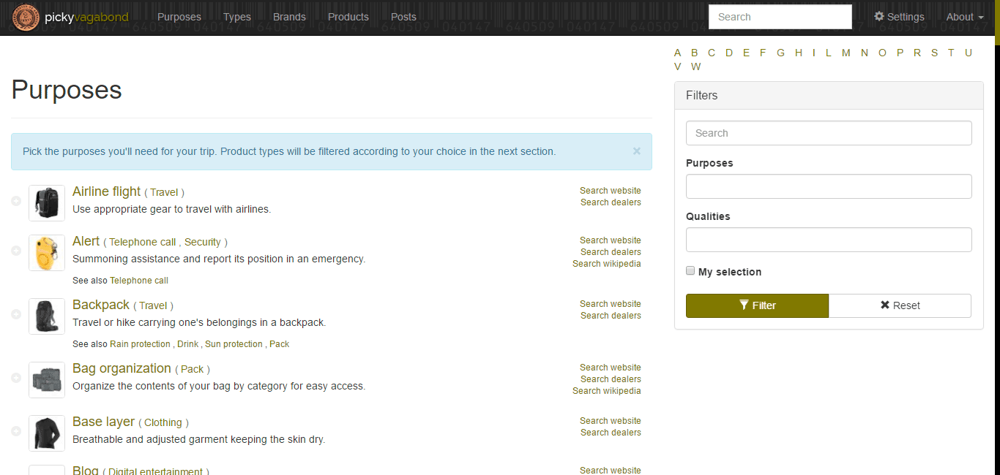

# -={ PICKYVAGABOND }=-

[Demo](https://chrisbo246.github.io/pickyvagabond/)

A Jekyll powered app that helps you with your packing list.



## Getting Started

These instructions will get you a copy of the project up and running on your local machine for development and testing purposes. See deployment for notes on how to deploy the project on a live system.

### Prerequisities

If you don't have Ruby installed, [install Ruby 2.0.0 or higher](https://www.ruby-lang.org/en/downloads/).
```
ruby --version
gem install bundler
```

### Installing

```
bundle install
```

### Testing

```
bundle exec jekyll serve
```

[http://127.0.0.1:4000/](http://127.0.0.1:4000/)

## Deployment

```
bundle exec jekyll build
```

Then publish the full project to the master branch.

<!--
## Contributing
Please read [CONTRIBUTING.md](CONTRIBUTING.md) for details on our code of conduct, and the process for submitting pull requests to us.
-->

## Bugs

Please use the [GitHub issue tracker](https://github.com/chrisbo246/pickyvagabond/issues) for all bugs and feature requests. Before creating a new issue, do a quick search to see if the problem has been reported already.

## Author

[chrisbo246](https://github.com/chrisbo246)
See also the list of [contributors](https://github.com/chrisbo246/pickyvagabond/contributors) who participated in this project.

<!--
## License
This project is licensed under the MIT License - see the [LICENSE.md](LICENSE.md) file for details
-->
